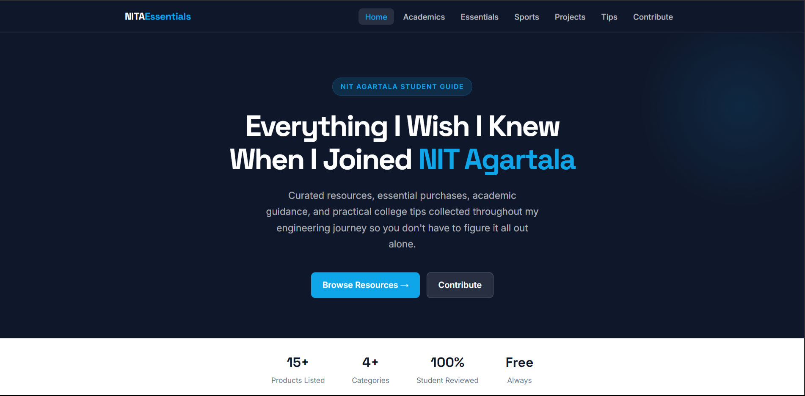
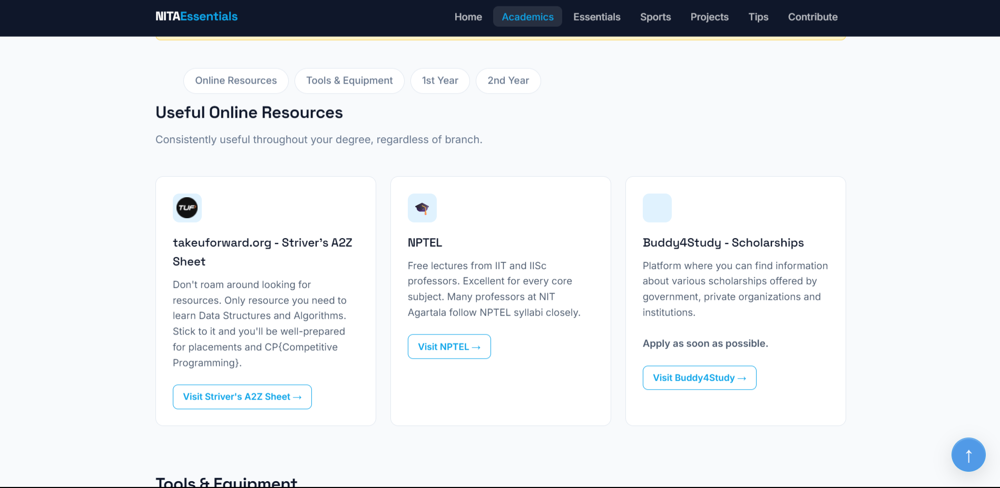
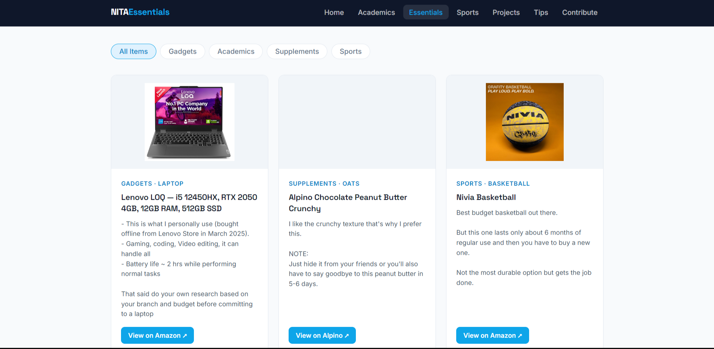
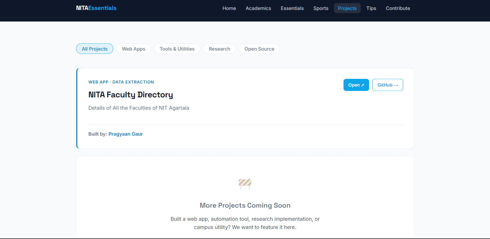

# NITA Essentials

A student-driven resource hub designed to help NIT Agartala students make informed decisions throughout their college journey.

## 🚀 Project Overview

When I first joined college, I was often confused about many practical aspects of student life:
* What books and academic materials should I follow?
* Which gadgets, stationery, and hostel essentials are actually worth buying?
* What resources can help me perform better academically?
* What sports and extracurricular items are useful?
* What mistakes should I avoid during college?

Most of this information was scattered across conversations with seniors, friends, and online sources. Over time, I learned what worked, what didn't, and what I wish I had known earlier.

**NITA Essentials** was created to bring all of that knowledge together in one place, helping students save time, avoid unnecessary expenses, and make better decisions throughout their college life. Instead of searching through multiple sources or relying solely on word-of-mouth advice, students can access curated recommendations and practical guidance in a centralized, easy-to-use website.

---

## 📸 Preview

Here is a glimpse of the NITA Essentials platform:

<div align="center">
  
  
  
  
</div>

---

## 📂 Project Structure & File Explanations

The project is built using HTML, CSS, and Vanilla JavaScript. We have intentionally kept the tech stack simple and modular to make it highly accessible for students to contribute.

Here is the current directory structure and a detailed explanation of what each file does:

```text
nita-essentials.github.io-main/
│
├── index.html          # The landing page. Introduces the platform's objective and provides quick navigation to all main categories.
├── about.html          # The about page. Details the story behind NITA Essentials, why it was created, and its core mission.
├── academics.html      # Study-related resources. Includes links to PYQs, syllabus copies, YouTube channels, and essential tools like calculators.
├── essentials.html     # Core recommendations page. Lists tried-and-tested gadgets, hostel items, and supplements used by actual students.
├── projects.html       # A showcase portal. Features web apps, tools, and research projects built by NITA students to encourage campus innovation.
├── sports.html         # Extracurricular guide. Holds gear recommendations for clubs like Hoopers NITA (Basketball) and general sports like Badminton.
├── tips.html           # Practical advice. Covers everything from hostel survival (padlocks, power banks) to placement tips (LeetCode, CGPA).
├── contribute.html     # Contribution guide. Provides a step-by-step tutorial on how students can fork the repo, make changes, and submit PRs.
│
├── footer.html         # A modular HTML component containing the website's footer. It is fetched and injected dynamically into every page.
├── notices.js          # A custom JavaScript file responsible for handling dynamic announcements and alerts across the platform.
│
├── css/
│   └── styles.css      # The global stylesheet. Controls the responsive layout, modern aesthetics, and typography for the entire site.
│
└── icon/               # Assets directory. Contains web app manifests, favicons, and preview screenshots used in this README.
```

---

## ✨ Features & Functionality

* **Comprehensive Resource Hub:** Curated lists spanning academics, hostel essentials, sports, projects, and general college tips.
* **Modular Design:** Uses reusable components (like `footer.html`) for easier maintenance.
* **Dynamic Content:** A custom `notices.js` script to handle and display the latest announcements seamlessly.
* **Responsive Layout:** Clean, accessible styling provided by `styles.css` ensuring a good experience on both desktop and mobile.
* **Community Driven:** An open invitation for students to contribute, correct, and add new resources.

---

## 🗺️ Website Structure & Navigation

The platform is divided into several key sections to help you find exactly what you need. Here's a detailed breakdown of what each page offers:

### 📚 Academic Resources (`academics.html`)
* **First-Year Essentials:** Access "God Level" resources like Sombaba Notes and the BS-MS Resource Hub for notes, books, and PYQs (Previous Year Questions).
* **Branch-Specific 2nd-Year Materials:** Dedicated folders for ECE, Civil, CSE, Mechanical, and BioTech containing PYQs and semester-wise study materials.
* **Online Platforms:** Links to crucial learning platforms like takeuforward (for Data Structures and Algorithms), NPTEL for core lectures, and Buddy4Study for scholarships.
* **Tools & Equipment:** Advice on physical tools needed for coursework, such as scientific calculators (Casio FX-82MS), mini drafters, and drawing boards.

### 🛒 Essential Purchases (`essentials.html`)
* **Gadgets:** Recommendations on tried-and-tested laptops (e.g., Lenovo LOQ) for coding and gaming, budget-friendly earphones (Samsung EHS64, boAt), and wireless earbuds (Nothing Ear Buds Pro 2).
* **Supplements & Groceries:** Budget-friendly protein options like Alpino Peanut Butter and Yogabar Oats for fitness enthusiasts.
* **Daily Use & Academics:** Recommendations for table lamps for late-night studying and reliable sports footwear (Asian, Campus) for regular campus wear.

### 🏃 Sports & Extracurriculars (`sports.html`)
* **Basketball (Hoopers NITA):** Essential gear recommendations for joining the campus basketball club, from budget-friendly Nivia Combat shoes to proper moisture-wicking jerseys and sports socks.
* **Badminton:** Guidance on beginner-friendly rackets and court-specific shoes to prevent injuries.
* *More sports gear guides will be added through community contributions.*

### 💡 College Tips (`tips.html`)
* **Hostel Life:** Immediate necessities (buy a padlock on day one), navigating power cuts (power banks and torches), and joining the "Buy & Sell NITA" WhatsApp group to score second-hand essentials.
* **Academics & Exams:** Why you shouldn't skip labs, the importance of PYQs for exams, and why wearing an analog watch to exams is a lifesaver.
* **Placements & Internships:** Early actionable advice: start LeetCode in your 1st year, build projects in your 2nd year, create a LinkedIn profile early, and maintain an 8.5+ CGPA.
* **Productivity:** Avoiding burnout by protecting your sleep schedule, learning to say "NO," and maximizing the first two weeks of the semester.

### 🛠️ Projects (`projects.html`)
* **Student Showcases:** Explore web apps, tools, and research created by NITA students.
* **Featured Projects:** Includes tools like the "NITA Faculty Directory" data extraction web app.
* **Submission Portal:** A place to submit your own side projects, coursework implementations, or open-source contributions for campus recognition.

---

## 🤝 How to Contribute

NITA Essentials is a community-driven project, and contributions from students are always welcome. Help us keep the information accurate, up-to-date, and useful for everyone!

### Contribution Guidelines
1. **Fork the repository** to your own GitHub account.
2. **Create a new branch** for your feature or fix (`git checkout -b feature/AddNewResource`).
3. **Make your changes** in the appropriate HTML files.
4. **Commit your updates** with clear, descriptive messages.
5. **Push to your branch** and **Open a Pull Request**.

### Contribution Policy
* Anyone can submit a Pull Request.
* Every contribution will be reviewed before acceptance.
* Contributions may be modified or rejected if they contain inaccurate, promotional, or low-quality information.

For more details, check out the [`contribute.html`](contribute.html) page on the live site.

---

## 🔮 Future Roadmap

* Expand academic resources across all departments.
* Add more student-contributed recommendations and projects.
* Implement a search functionality for faster navigation.
* Create department-specific and year-specific guides.
* Enhance the UI/UX with modern design elements and dark mode.
* Build a larger community knowledge base for NIT Agartala students.

---

## ⚖️ Affiliate Disclosure

Some links on NITA Essentials may be affiliate links. If you purchase a product through one of these links, NITA-Essential earns a small commission at **no additional cost to you**.

The primary goal of this platform is to help students make informed decisions. Affiliate commissions do **not** determine which products are recommended; everything featured here is based on personal experience, student recommendations, and utility. These commissions help maintain the website and cover development and educational expenses.

---

## 📄 License

This project is open-source and available under the GPL 2.0 License.

---

## ❤️ Built by Students, for Students

If NITA Essentials helps you, consider contributing to make it even better for future students.
