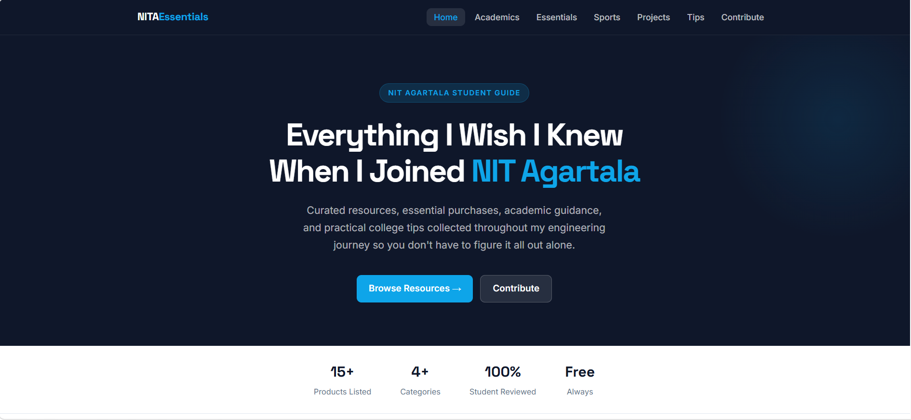
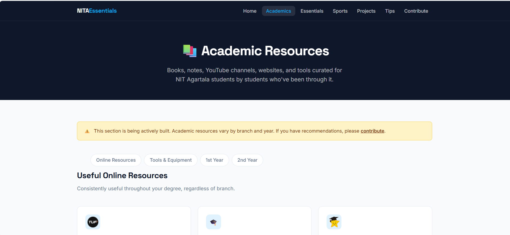
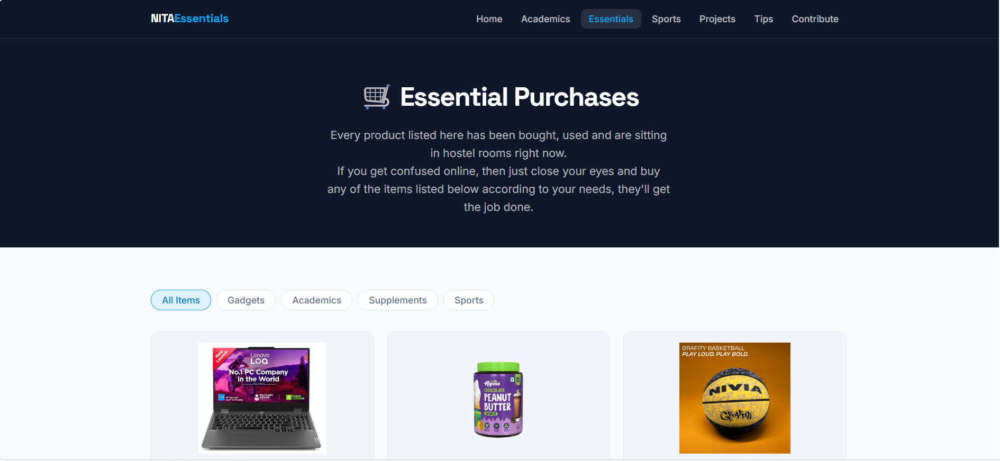
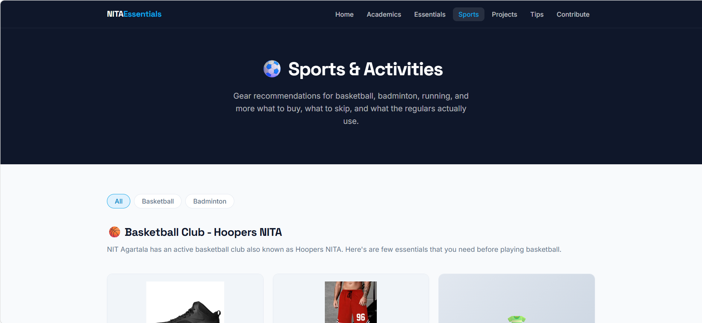
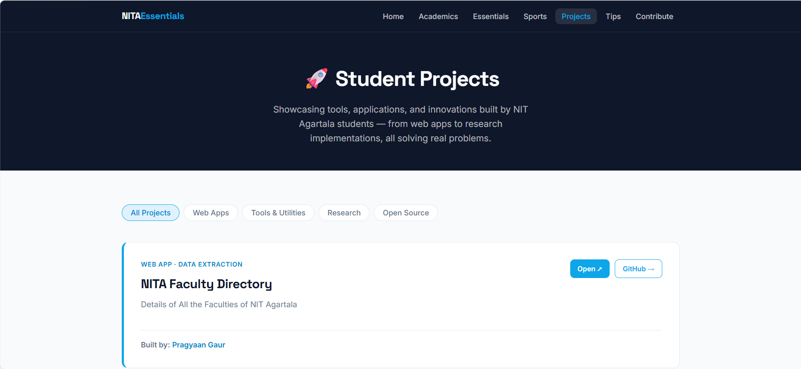

# NITA Essentials

A student-driven resource hub that helps students of the **National Institute of Technology Agartala (NIT Agartala)** make informed decisions throughout their college journey.

Whether you're joining NITA for the first time or preparing for graduation, NITA Essentials brings together practical advice, academic resources, buying guides, sports recommendations, student projects, and community contributions in one place.

---

## 🌐 Live Website

https://nita-essentials.github.io/

---

# 📖 About the Project

When new students join college, they often have the same questions:

- Which books should I study from?
- What hostel essentials are actually worth buying?
- Which calculator, laptop, or stationery should I get?
- What academic resources do seniors recommend?
- What sports equipment should I buy?
- What common mistakes should I avoid?

Most of this information is scattered across WhatsApp groups, seniors, friends, and countless conversations.

**NITA Essentials** was created to collect that knowledge in one place, helping students save time, avoid unnecessary expenses, and make better decisions throughout college.

---

# ✨ Features

- 📚 Academic resources and study materials
- 🛒 Curated hostel and college essentials
- 🏀 Sports equipment recommendations
- 💡 Practical college tips
- 🚀 Student project showcase
- 🤝 Community contribution system
- 📱 Responsive design for desktop and mobile
- 🔍 Category filtering
- 🔔 Notice system
- ⬆️ Auto-hide navigation while scrolling
- 🧩 Modular reusable footer
- 🎯 Easy-to-maintain HTML structure

---

# 📄 Website Pages

The website currently contains the following sections:

- 🏠 Home
- 📚 Academics
- 🛒 Essentials
- 🏀 Sports
- 🚀 Student Projects
- 💡 Tips
- 🤝 Contribute
- ℹ️ About

Each section focuses on a different aspect of student life and is designed to be easy to browse.

---

# 📚 What You'll Find

## Academics

- Study materials
- Books
- Online resources
- Academic tools
- Department resources
- Semester resources

## Essentials

- Hostel items
- Electronics
- Stationery
- Daily-use products
- Budget recommendations

## Sports

- Basketball gear
- Badminton equipment
- Sports accessories
- Campus activity recommendations

## Student Projects

- Student-built websites
- Campus tools
- Open-source projects
- Research implementations

## Tips

- Productivity advice
- Time management
- College survival tips
- Practical lessons from seniors

---

# 📁 Project Structure

```
nita-essentials.github.io/
│
├── css/
│   └── styles.css
│
├── icon/
│
├── about.html
├── academics.html
├── contribute.html
├── essentials.html
├── footer.html
├── index.html
├── notices.js
├── projects.html
├── sports.html
├── tips.html
└── README.md
```

---

# 🤝 Contributing

NITA Essentials is a community-driven project, and contributions are always welcome.

You can contribute by:

- Adding useful resources
- Improving existing content
- Fixing bugs
- Improving documentation
- Sharing student projects
- Suggesting better products
- Adding college tips

---

## How to Contribute

1. Fork this repository.
2. Create a new branch.

```
git checkout -b feature/your-feature
```

3. Make your changes.

4. Commit your work.

```
git commit -m "Describe your changes"
```

5. Push the branch.

```
git push origin feature/your-feature
```

6. Open a Pull Request.

Every contribution is reviewed before being merged.

---

# 📋 Contribution Policy

To keep recommendations trustworthy:

- All submissions are manually reviewed.
- Promotional or misleading content is rejected.
- Inaccurate information may be edited or removed.
- Contributors may be asked to revise their submissions before approval.

The goal is to ensure students receive useful, honest, and reliable recommendations.

---

## 📷 Screenshots

### Home Page



### Academics



### Essentials



### Sports



### Projects



---

# 🛣️ Roadmap

Future improvements include:

- 🌙 Dark mode
- 🔍 Global search
- 📖 Student blog
- 📱 Improved mobile navigation
- 📚 Department-specific academic resources
- 🎓 Career roadmaps
- 🏆 More student project showcases
- 🤖 Better contribution workflow

---

# 💰 Affiliate Disclosure

Some product links may be affiliate links.

If you purchase through one of these links, NITA Essentials may earn a small commission **at no additional cost to you.**

Affiliate commissions help support:

- Website maintenance
- Hosting
- Development
- New resources
- Continued improvements

Recommendations are never influenced solely by affiliate earnings.

---

# ⚠️ Disclaimer

Recommendations on this website are based on personal experience, research, and community contributions.

Students should always use their own judgment before making purchasing, academic, or personal decisions.

Individual needs may vary.

---

# 📜 License

This project is licensed under the **GPL-2.0 License**.

---

# ❤️ Built by Students, for Students

If NITA Essentials helped you, consider contributing so future students can benefit too.

Every contribution—whether it's a tip, resource, bug fix, or new feature—helps make the project better.